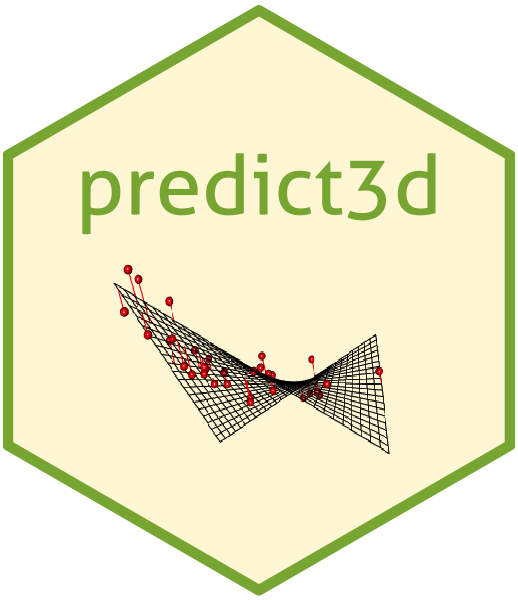

R package predict3d 
=======================================================================================
[](https://cran.r-project.org/package=predict3d)


R package `predict3d` aims to draw predicts plot for various regression models. The main two functions are ggPredict() for 2-dimensional plot and predict3d() for 3-dimensional plot.

## Package Installation

You can install `predict3d` package from CRAN.

```r
install.packages("predict3d")
```

You can install the developmental version of `predict3d` package from github.


```r
if(!require(devtools)) install.packages("devtools")
devtools::install_github("cardiomoon/predict3d"")
```

## Linear Regression Models

You can draw linear regression models. First model has one categorical and one continuous explanatory variables.


```r
require(predict3d)
require(rgl)
fit1=lm(Sepal.Length~Sepal.Width*Species,data=iris)
fit1

Call:
lm(formula = Sepal.Length ~ Sepal.Width * Species, data = iris)

Coefficients:
                  (Intercept)                    Sepal.Width  
                       2.6390                         0.6905  
            Speciesversicolor               Speciesvirginica  
                       0.9007                         1.2678  
Sepal.Width:Speciesversicolor   Sepal.Width:Speciesvirginica  
                       0.1746                         0.2110  
```

You can draw plot for this model. ggPredict() function draws a scatterplot with regression line and shows regression equations parallel to the regression lines.


```r
ggPredict(fit1,digits=1)
```


```r
predict3d(fit1,radius=0.05)
rglwidget(elementId = "1st")
```


You can see the live 3d plot at http://rpubs.com/cardiomoon/471347.

The second model has two continuous variables as explanatory variables. You can change the labels and the relative x position and the y position.


```r
fit2=lm(mpg~wt*hp,data=mtcars)
ggPredict(fit2,labels=paste0("label",1:3),xpos=c(0.3,0.4,0.3))
```


```r
predict3d(fit2)
rglwidget(elementId = "2nd")
```


## Generalized Linear Models

You can draw generalized linear models.


```r
require(TH.data)
fit3=glm(cens~pnodes*age*horTh,data=GBSG2,family=binomial)
ggPredict(fit3,se=TRUE,show.text = FALSE)
```


```r
predict3d(fit3,radius=0.5)
rglwidget(elementId = "3rd")
```


## Local Polynomial Regression Fitting

You can draw the loess model.


```r
fit=loess(mpg~hp*wt,data=mtcars)
ggPredict(fit)
```


```r
predict3d(fit,radius=2)
rglwidget(elementId = "4th")
```


## Play with predict3d()

Once you have create a model with predict3d(), you can move your object with your mouse or R codes. For example, You can rotate you object with this R codes.


```r
start <- proc.time()[3]
while ((i <- 36*(proc.time()[3] - start)) < 360) {
     rgl.viewpoint(i, i/4); 
}
play3d(spin3d(axis = c(1, 0, 0), rpm = 30), duration = 2)
```

You can save your 3d plot as a figure file or pdf file.


```r
rgl.bringtotop()
rgl.snapshot("fig1.png")
rgl.postscript("fig2.pdf","pdf")
```

For more information about package `rgl`, please read the package vignette at: https://CRAN.R-project.org/package=rgl/vignettes/rgl.html

You can see the following vignettes published on rpubs.com

[Drawing the multiple regression models(Part I)](http://rpubs.com/cardiomoon/474707)
